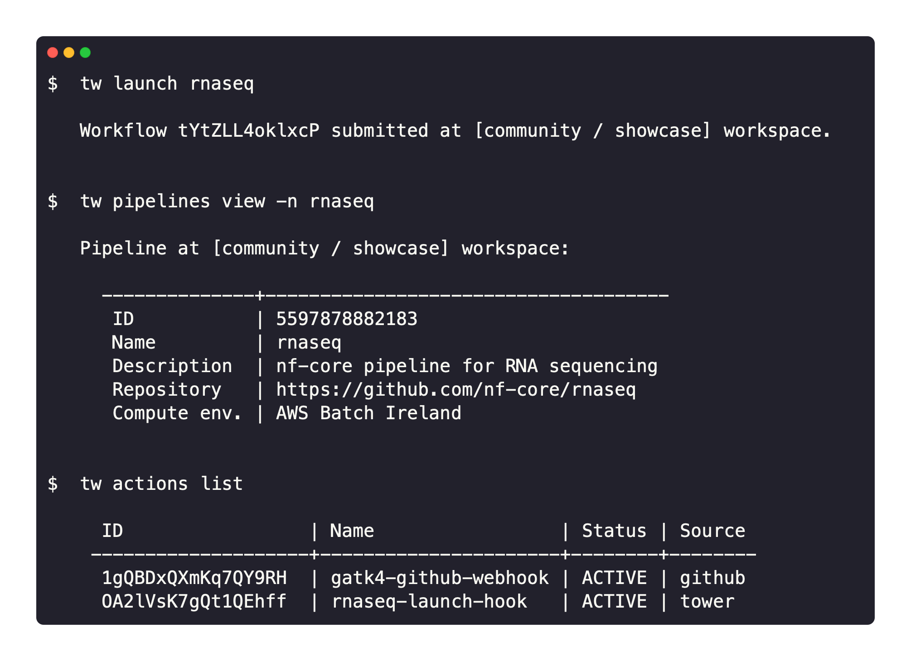

# tw CLI

`tw` is [Seqera Platform](https://cloud.seqera.io/) on the command line. It brings Seqera concepts like pipelines, actions, and compute environments to the terminal.

Seqera Platform is a full-stack application for the management of data pipelines and compute resources. It enables collaborative data analysis at scale, on-premises or in any cloud.

The CLI interacts with Platform to provide an interface to launch pipelines, manage cloud resources, and administer your analysis.

See the [Platform CLI documentation](https://docs.seqera.io/platform/24.1/cli/overview) for installation and usage guidance. 

## License

[Apache 2.0](https://github.com/seqeralabs/tower-cli/blob/master/LICENSE.txt)
